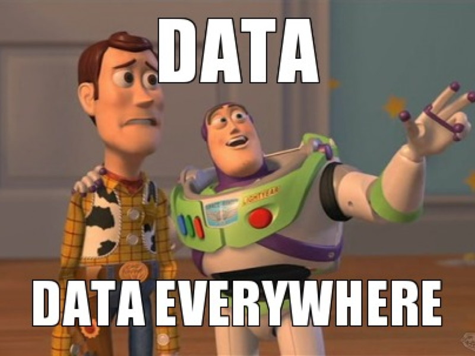

# Journal — 2025-09-13 — DAY 1: SQL & ETL Basics

## 1) What I learned

- I learned how to use DBeaver and Metabase
- DE is easy learn but hard to master, Data is scalable
- Data Engineering - moving data, building foundations for data, to make other Data roles job easier
- Who needs DEs? companies with strong IT implementations
- Architect - planning, Engineering - building, Science - causality, Business - strategies
- Clickhouse - example of database, it is meant to store data, popular > RDBMS
- Clickhouse is a column oriented SQL DBMS for OLAP
- compression is important in DE, compression (look for similarity)

## 2) New vocabulary (define in your own words)

- OLAP — transactional, row-oriented db, fast
- OLTP - analytical, column-oriented db, slow
- Transform(ETL vs ELT) - you make changes to the data

## 3) Data Engineering mindset applied (what principles did I use?)

- Building trust starts with getting data in. Even if the pipeline is simple, the discipline is about repeatability and traceability.

## 4) Decisions & assumptions (why, alternatives, trade-offs)

- During a dbt exercise, I had trouble cleaning the raw data because there were still null values left, especially in the horsepower column, which could affect the results of any analysis. To solve this, I learned how to navigate the dbt project structure and made changes to the SQL code in the model to properly clean the data and remove the missing values. After updating the code, I used the following query to check if any null values were still present: SELECT COUNT(\*) FROM clean.autompg\_\_cars WHERE horsepower IS NULL;. This helped me confirm that the cleaning steps were working as expected and that the data was ready for further use.

## 5) Open questions (things I still don’t get)

- When should you use dlt?
- How do DEs ensure that the data is clean? especially for big amounts of data
- When should you use dbt in business? What do other DEs use besides dbt?

## 6) Next actions (small, doable steps)

- [ ] research and read more about Data Engineering Lifecycle
- [ ] study OLAP vs OLTP
- [ ] checkout https://www.geeksforgeeks.org/sql/sql-ddl-dql-dml-dcl-tcl-commands/

## 7) Artifacts & links (code, queries, dashboards)

- DEP: https://dataengineering.ph/
- SQL: https://www.geeksforgeeks.org/sql/sql-ddl-dql-dml-dcl-tcl-commands/
- dbt: https://www.datacamp.com/tutorial/what-is-dbt
- dlt: https://www.datacamp.com/tutorial/python-dlt

---

### Mini reflection (3–5 sentences)

I'm really surprised at how cool DBeaver is! This was my first time using it, and I found it very helpful for working with data. It made it easy to write and run SQL queries, and I liked how I could see the results right away. I also discovered that you can view database diagrams, which helped me understand how the tables are connected. It made exploring and understanding the data a lot easier, especially as someone still learning.

Metabase was also something I didn’t expect to enjoy, but it turned out to be very useful. It lets you take the tables and data you've worked on and turn them into clear, visual charts and graphs. This helped me see how my data cleaning and modeling work in dbt actually changed the final output. It felt rewarding to see how raw data can be transformed into something meaningful, and Metabase made that process easier to understand.

### BONUS: What is a meme that best describes what you feel or your learning today?

